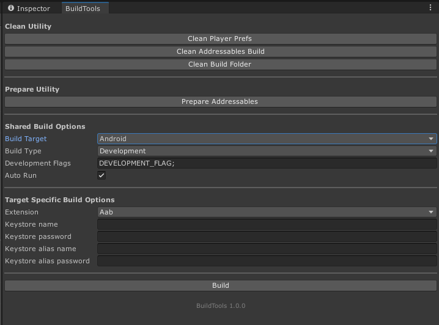

# unitytoolbox-utils

A simple, extendable tool to streamline the Unity build process

## Contents

The unitypackage will add a BuildTools menu in the Unity Editor

## Installing

Download and install the unitypackage from the latest release

## Built With

* Unity 2020.2.1f1

## Authors

* **Davide Jones**

## License

This project is licensed under the MIT License - see the [LICENSE](LICENSE) file for details
